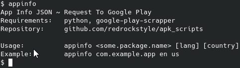

# APK Scripts

Helper-tools for testing Android applications

## Supported Features

- **Target specification**:   Package name format (e.g., `com.example.app`) and package file (XAPK, APKM, APKS)
- **General information gathering**:   App version, package name, minimum/target SDK and MainActivity class name
- **Content Analysis**:   Manifest parsing, app permissions and internal directories
- **Automations**:   Simplifies app handling and runtime environment setup

## Requirements
For proper operation, you need:
- Android SDK installed
- An Android device connected via `adb connect`
- google-play-scrapper (py lib for appinfo.sh)

## Install / Uninstall
`sudo bash install.sh` / `sudo bash uninstall.sh`

## Overview

<h2 align="center">AppQuick: Quick App Analysis</h2>

<h2 align="center">AppRun: Quick Runtime Actions</h2>

<h2 align="center">AppInfo: Request To Google Play</h2>

